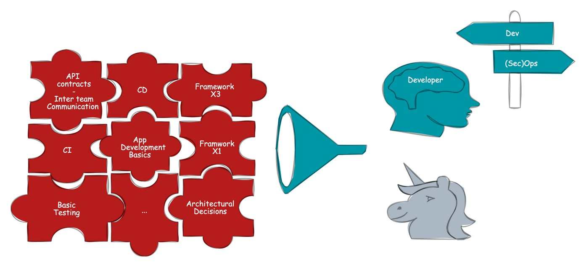
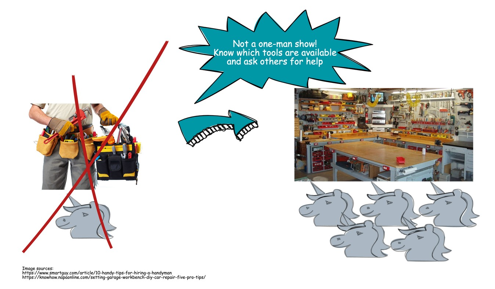

# Belgian Developer Experience Network - Manifest
## Mission statement
We hereby establish this Community Manifesto as a testament to our commitment to build, nurture, 
and sustain “Developer Experience Network” for the benefit of all its members and the broader objectives 
we collectively serve. This document outlines the principles of conduct, collaboration, and governance 
that will guide our actions and interactions within this community.

 silos.")

Nowadays, **developers** have a huge number of responsibilities. These encompass crucial decisions such as 
selecting and implementing appropriate CI/CD tooling, choosing optimal runtimes like SpringBoot, 
Micronaut, Quarkus, and making informed choices regarding libraries, including logging libraries, 
tracing libraries, and utilities. Additionally, developers are tasked with determining the suitable 
database technology for their applications, devising sound software architectures, crafting test 
architectures, implementing diverse test scenarios, and staying abreast of the dynamic landscape of 
software development. In summary, **the scope of responsibilities is extensive**.

Moreover, organizations frequently maintain **compartmentalized structures**, a legacy from previous eras 
characterized by distinct departments such as operations, infrastructure, multiple development units, 
a board of architects, and potentially a security team. These entities function as individualized teams, 
often relying on communication through ticketing systems such as Jira or ServiceNow. The transition to 
cloud computing has introduced a collaborative synergy encompassing infrastructure, operational 
components, security, and application development based on technology. However, this synergy has been 
historically absent in team structures, resulting in a noticeable gap.

The Developer Experience Network represents **an initiative aimed at bridging existing gaps** by fostering 
communication between silos, always viewing matters through the lens of a developer. Some examples are:
* Why an immutable cluster? (It is not that the organization doesn’t trust their developers).
* Why universal base images instead of Docker Hub images?
* Why zero-trust networks?
* What is the added value of something like Backstage?

It is noteworthy that not all discussions within the group are centered around infrastructure, 
operations, or security. Purely developer-centric topics, such as updates in Java x and proper 
Domain-Driven Design (DDD) implementation, will find their place within this community as well.

It is crucial to underscore that **the intent is not to empower developers to undertake every task**, 
such as installing and configuring message buses or service meshes. Rather, the emphasis is on 
equipping developers with knowledge about existing tools, **enabling them to make informed decisions** and 
collaborate with other teams for successful implementations.

## Values
Our community is founded on the following core values:
* **Respect**:   
    We commit to fostering an environment of mutual respect, where every voice is heard, 
    and every contribution valued.
* **Integrity**:    
    We pledge to act with honesty, transparency, and accountability in all our dealings.
* **Collaboration**:    
    We believe in the power of partnership and collective action to achieve our goals.
* **Innovation**:    
    We encourage creativity, experimentation, and the pursuit of excellence.
* **Inclusivity**:    
    We are dedicated to building a welcoming and diverse community, where everyone has the opportunity to learn, contribute, and grow.

